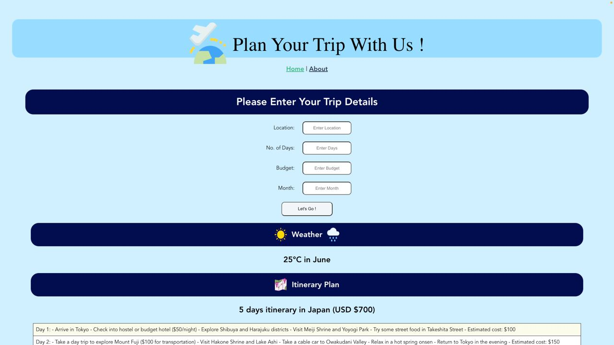

# Vacation Hacks

Vacation Hacks aims to help users plan their travel itineraries efficiently. It provides a user-friendly interface where users can input their travel preferences, such as destination, duration of stay and budget. The system then generates a personalized travel itinerary as well as weather information based on the provided information. 
https://devpost.com/software/vacation-hacks?ref_content=user-portfolio&ref_feature=in_progress

https://www.youtube.com/watch?v=N0SKqduV6-c


## Key Features
1. Customizable Itineraries: Users can input their desired destination, travel dates, and preferences, allowing the system to generate tailored itineraries.

2. Activity Recommendations: The system suggests popular attractions, landmarks, and activities based on the selected destination, providing users with a variety of options to choose from.
3. Weather Information: Users can access real-time weather information for their selected destination, helping them plan activities and pack accordingly.

Done by: Kaitlyn Goh, Jamie Tan, Lu Yi Fan

## Getting Started
To get started with Vacation Hacks, please follow these steps:

1. Clone the repo
   ```sh
   git clone https://github.com/GRight-Hackathon/frontend.git
   ```
2. Install the dependencies
   ```sh
   npm install
   ```
3. Get your OpenAI private key and store it in an `.env` file in the root directory of the project under the name VITE_APP_API_KEY. For example this should be how your `.env` file looks like:
    ```sh
    VITE_APP_API_KEY="INSERT_YOUR_API_KEY_HERE"
    ```
4. To run in a development environment, just run `npm run dev`.
5. If you need to build for production, just run `npm run build` to build a production ready application.


